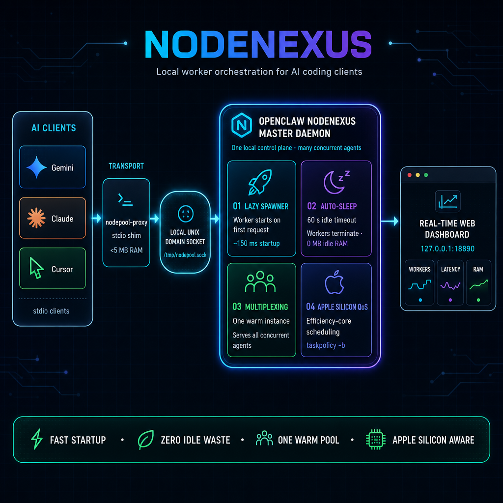
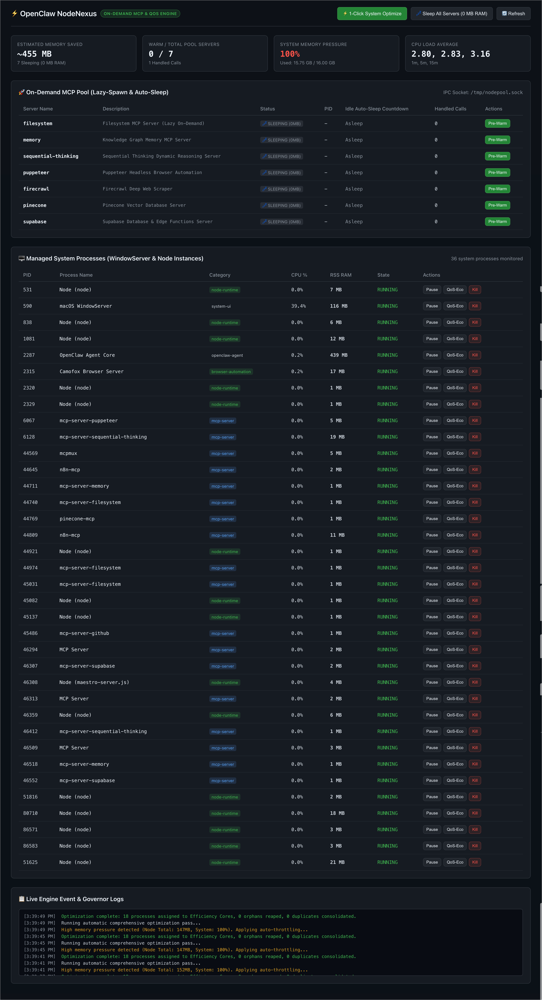

# ⚡ NodeNexus

> **Local worker orchestration and on-demand MCP pooling engine for AI coding clients on macOS.**



---

## 📌 Overview

**The Problem:** Standard MCP clients (Gemini, Claude, Cursor, OpenClaw, Antigravity) each spawn separate stdio child processes with npx for every tool. With multiple agents and subagents running, this produces 24 to 40+ long-running V8 processes consuming 2–4 GB+ of RAM and starving macOS WindowServer.

**The Solution:** We designed, built, and deployed OpenClaw NodeNexus (openclaw-nodepool + sysgov), combining the best open-source paradigms into a unified, ultra-lightweight macOS engine.

---

## ✨ Key Features

* 🚀 **0 MB Cold Footprint (Lazy On-Demand Spawning):** All configured MCP servers remain completely offline (0 MB RAM) until a tool call is executed by an LLM.
* ⚡ **Ultra-Low Latency Warmup (~150ms):** Automatically spins up the required tool on first call and routes JSON-RPC messages seamlessly.
* 💤 **60-Second Auto-Sleep Reaper:** Gracefully reaps idle workers after 60 seconds of inactivity, returning memory consumption to 0 MB.
* 🔄 **Shared Connection Multiplexing:** Multiple concurrent AI agent sessions share a single warm instance over a zero-latency local Unix Domain Socket (`/tmp/nodepool.sock`).
* 🍏 **Apple Silicon Efficiency Core QoS:** Automatically assigns background processes to Efficiency Cores via `taskpolicy -b`, leaving Performance Cores 100% dedicated to WindowServer and interactive apps.
* 📊 **Real-Time Web Dashboard & CLI:** Embedded Web UI on `http://127.0.0.1:18890` and full CLI suite (`nodepool status`, `sysgov optimize`).

---

## 🖥️ Live Web Dashboard



Open `http://127.0.0.1:18890` in your browser for real-time monitoring of:
* **On-Demand Pool Status:** Live badges (`🔥 WARM` vs. `💤 SLEEPING`), countdown timers, and handled call metrics.
* **System Process Governor:** WindowServer CPU, memory pressure gauges, and one-click actions (Pause, Resume, Kill, QoS-Eco).
* **Live Engine Event Logs:** Instant stream of on-demand spawns, deduplications, and idle terminations.

---

## 🚀 Quick Start

### 1. Installation

```bash
git clone https://github.com/jakedadogg00/NodeNexus.git ~/.openclaw/NodeNexus
cd ~/.openclaw/NodeNexus
npm link
```

Or run the one-line setup script:
```bash
./install.sh
```

### 2. Start the Daemon

```bash
# Start background daemon
nodepool start

# Check status
nodepool status
```

### 3. CLI Commands

```bash
# View live on-demand pool status & memory savings
nodepool status

# Manually pre-warm a server
nodepool warm sequential-thinking

# Force an active server to spin down immediately (drop to 0 MB RAM)
nodepool sleep sequential-thinking

# Spin down all active servers across the system
nodepool sleep-all

# Trigger 1-click system memory and WindowServer optimization
sysgov optimize

# View global process manager table
sysgov status
```

---

## 🔌 Drop-In AI Client Configuration

Replace heavy direct `npx` commands in your AI client MCP configs with `nodepool-proxy`:

### Antigravity / Gemini CLI (`mcp_config.json`)
```json
{
  "mcpServers": {
    "sequential-thinking": {
      "command": "/Users/maxbutler/bin/nodepool-proxy",
      "args": ["sequential-thinking"]
    },
    "filesystem": {
      "command": "/Users/maxbutler/bin/nodepool-proxy",
      "args": ["filesystem"]
    }
  }
}
```

### Claude Desktop / Cursor (`mcp.json`)
```json
{
  "mcpServers": {
    "memory": {
      "command": "nodepool-proxy",
      "args": ["memory"]
    },
    "puppeteer": {
      "command": "nodepool-proxy",
      "args": ["puppeteer"]
    }
  }
}
```

### Codex / OpenClaw (`mcpmux-gateway.json`)
```json
{
  "servers": [
    {
      "id": "firecrawl",
      "command": "nodepool-proxy",
      "args": ["firecrawl"]
    }
  ]
}
```

---

## 🏗️ Architecture Breakdown

```
[ AI Clients (Gemini / Claude / Cursor / OpenClaw) ]
                       │
                       ▼ stdio (<5MB shim)
               [ nodepool-proxy ]
                       │
                       ▼ Local IPC
          [ /tmp/nodepool.sock ]
                       │
       ┌───────────────┴───────────────┐
       ▼                               ▼
[ On-Demand Lazy Spawner ]    [ Apple Silicon QoS Governor ]
- Spins up in ~150ms           - taskpolicy -b (Efficiency Cores)
- 60s idle auto-sleep          - Reaps orphaned processes
- Deduplicates instances       - WindowServer protection
```

---

## 📄 License

MIT © Max Butler
